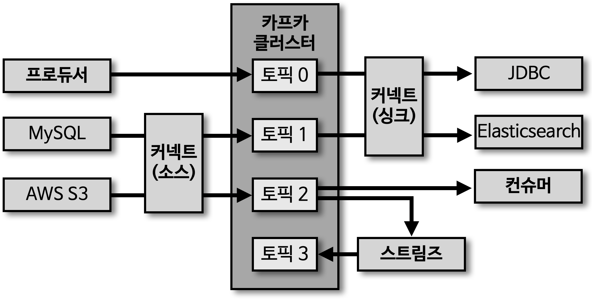
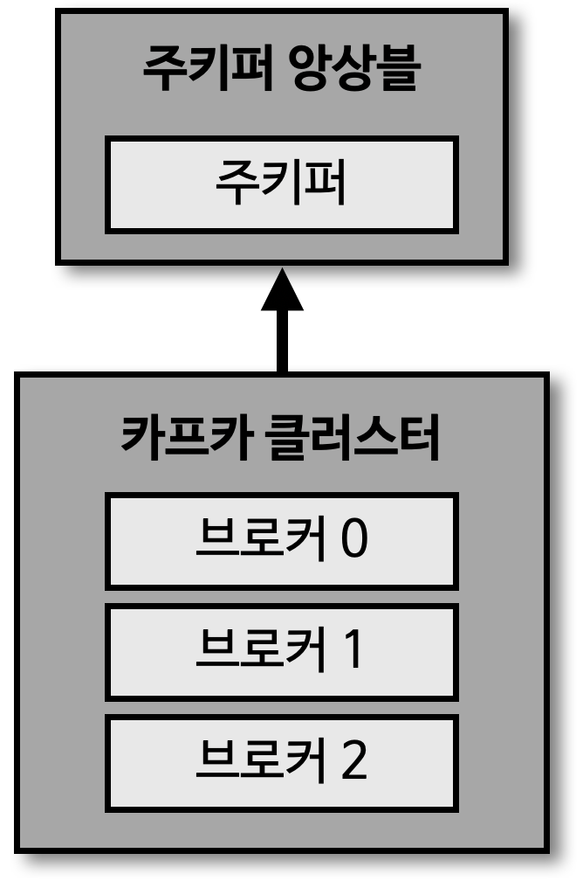

## Kafka 생태계



## Kafka 브로커, 클러스터, 주키퍼


Kafka 브로커는 Kafka 클라이언트와 데이터를 주고받기 위해 사용하는 주체이자, 데이터를 분산 저장하여 장애가 발생하더라도 안전하게 사용할 수 있도록 도와주는 애플리케이션이다.
하나의 서버에는 한 개의 Kafka 브로커 프로세스가 실행된다.
Kafka 브로커 서버 1대로도 기본 기능이 실행되지만 데이터를 안전하게 보관하고 처리하기 위해 3대 이상의 브로커 서비를 1개의 클러스터로 묶어서 운영한다.
Kafka 클러스터로 묶이 브로커들은 프로듀서가 보낸 데이터를 안전하게 분산 저장하고 복제하는 역할을 수행한다.



### 여러개의 Kafka 클러스터가 연결된 주키퍼


- Kafka 클러스터를 실행하기 위해서는 주키퍼가 필요
- 주키퍼의 서로 다른 znode에 클러스터를 지정
- root znode에 각 클러스터 별 znode를 생성하고 클러스터 실행시 root가 아닌 하위 znode로 설정

### 브로커의 역할

#### 컨트롤러

클러스터의 다수 브로커 중 한 대가 컨트롤러의 역할을 한다.
컨트롤러는 다른 브로커들의 상태를 체크하고 브로커가 클러스터에서 빠지는 경우 해당 브로커에 존재하는 리더 파티션을 재분배한다.
Kafka는 지속적으로 데이터를 처리해야 하므로 브로커의 상태가 비정상이라면 빠르게 클러스터에서 빼내는 것이 중요하다.
만약 컨트롤러 역할을 하는 브로커에 장애가 생기면 다른 브로커가 컨트롤러 역할을 한다.

#### 데이터 삭제

Kafka는 다른 메시징 플랫폼과 다르게 컨슈머가 데이터를 가져가더라도 토픽의 데이터는 삭제되지 않는다. 또한, 컨슈머나 프로듀서가 데이터 삭제를 요청할 수도 없다. 오직 브로커만이 데이터를 삭제할 수 있다.
데이터 삭제는 파일 단위로 이루어지는데 이 단위를 `로그 세그먼트` 라고 부른다. 이 세그먼트에는 다수의 데이터가 들어 있기 때문에 일반적인 데이터 베이스처럼 특정 데이터를 선별해서 삭제 할 수 없다.

#### 컨슈머 오프셋 저장

컨슈머 그룹은 토픽이 특정 파티션으로부터 데이터를 가져가서 처리하고 이 파티션의 어느 레코드까지 가져갔는지 확인하기 위해 커밋한다.
커밋한 오프셋은 _____consumer_offsets___ 토픽에 저장한다.
여기에 저장된 오프셋을 토대로 컨슈머 그룹은 다음 레코드를 가져가서 처리한다.

#### 그룹 코디네이터

코디네이터는 컨슈머 그룹의 상태를 체크하고 파티션을 컨슈머와 매칭되도록 분배하는 역할을 한다.
컨슈머가 컨슈머 그룹에서 빠지면 매칭되지 않은 파티션을 정상 동작하는 컨슈머로 할당하여 끊임없이 데이터가 처리되도록 도와준다. 이렇게 파티션을 컨슈머로 재할당하는 과정을 `리밸런스` 라고 부른다.

#### 데이터의 저장

카프카를 실행 할 때 config/server.properties의 log.dir 옵션에 정의한 디렉토리에 데이터를 저장한다.
토픽 이름과 파티션 번호의 조합으로 하위 디렉토리를 생성하여 데이터를 저장한다.
hello.kafka 토픽의 0번 파티션에 존재하는 데이터를 확인할 수 있다. log에는 메시지와 메타데이터를 저장한다.
index는 메시지의 오프셋을 인덱싱한 정보를 담은 파일이다. timeindex 파일에는 메시지에 포함된 timestamp 값을 기준으로 인덱싱한 정보가 담겨 있다.

```cmd
$ ls /tmp/kafka-logs
__consumer_offsets-0 __consumer_offsets-21
...
$ ls /tmp/kafka-logs/hello.kafka-0
00000000000000000000.index 00000000000000000000.log
00000000000000000000.timeindex leader-epoch-checkpoint
```

##### 로그와 세그먼트

```cmd
$ ls /tmp/kafka-logs/hello.kafka-0
00000000000000000000.log
00000000000000000010.log
00000000000000000020.log
```


- log.segment.bytes : 바이트 단위의 최대 세그먼트 크기 지정. 기본 값은 1GB
- log.roll.ms(hours) : 세그먼트가 신규 생성된 이후 다음 파일로 넘어가는 시간 주기. 기본 값은 7일.
- 가장 마지막 세그먼트 파일을 액티브 세그먼트라고 한다. 액티브 세그먼트는 브로커의 삭제 대상에서 포함되지 않는다. 액티브 세그먼트가 아닌 세그먼트는 retention 옵션에 따라 삭제 대상으로 지정된다. 